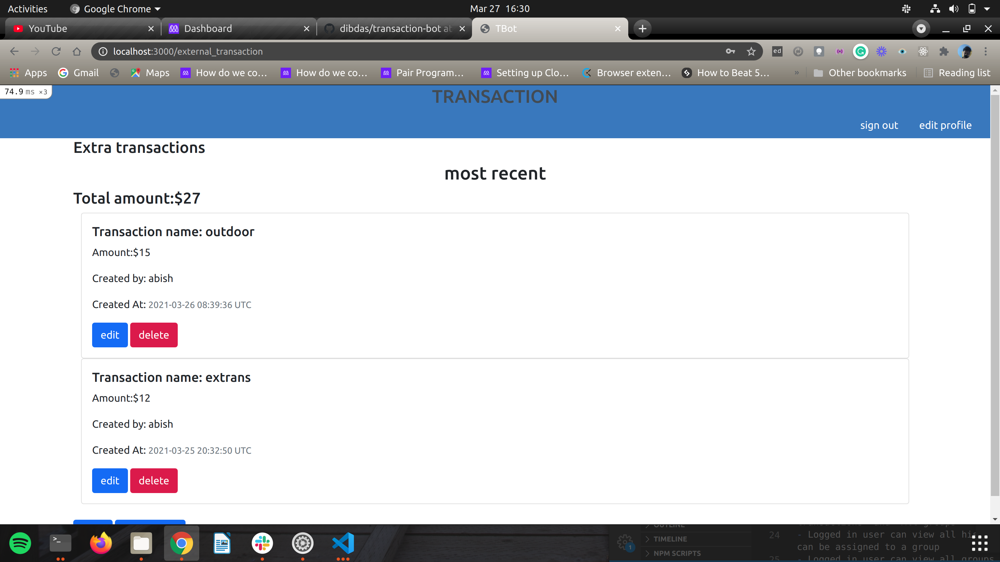
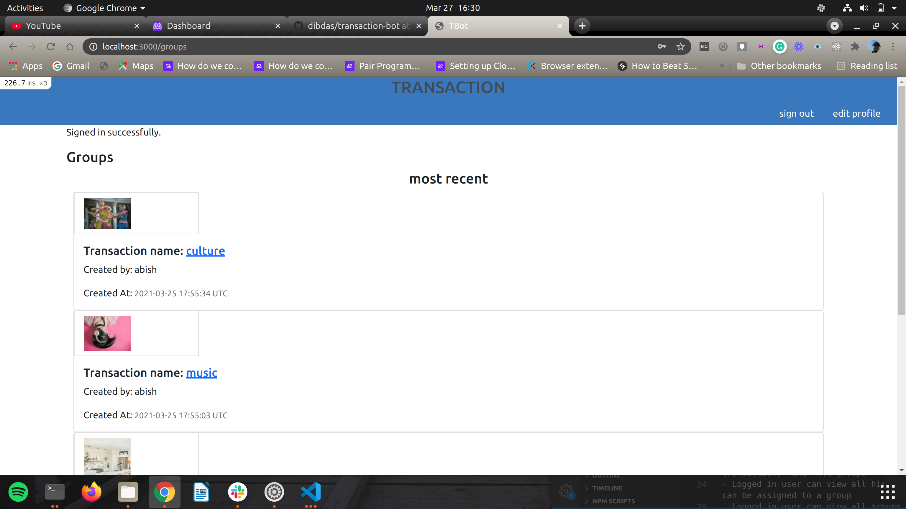
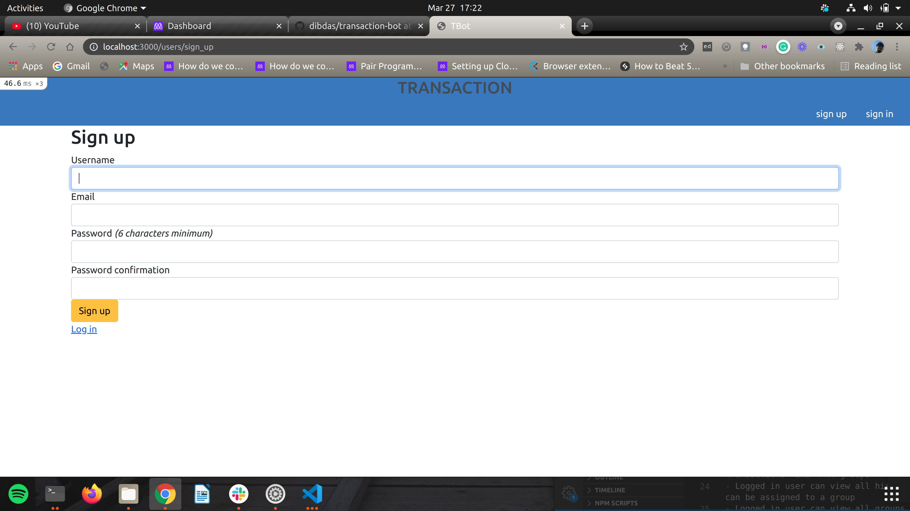
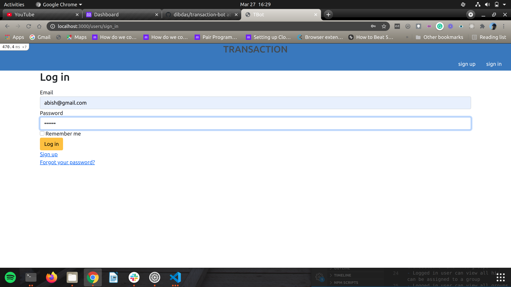

# Transaction app
gjkl

## Features

- User can signup and login
- Guest user can't access any other page in the app except login and signup pages
- Logged in user can access her and only her profile page
- Profile page provides links to "All my transactions", "All groups"
- Logged in user can view all his transactions and create new ones which can be assigned to a group
- Logged in user can view all groups and create a new
- Logged in user can visit show page of a group which will list all payments associated with it
- Followed TDD 

The data models were constructed according to the following Entity Relationship Diagram(ERD):

# All Extra Transaction page
> 

# All Transaction page
> 

# All Groups page
> 

# Group Transaction page
> 

# SignUp Page
> 

# login page 
> 

## Live Demo
https://lit-lake-53865.herokuapp.com/users/sign_in
- 
## Built With

- Ruby v2.6.5
- Ruby on Rails v6.0.2
- VSCode - code editor

## Getting Started

- Clone the repo `https://github.com/dibdas/t-bot`
- cd `into` the project
- Run `bundle install`
- Run `yarn install --check-files`
- Setup your `db` in the `database.yml` and run `rails db:setup`
- Run `rails s` and visit `localhost:3000`

### Run tests

- Run `bundle exec rspec` to run all the tests

## Author

👤 **Dibyendu Das**
- Github: [@dibdas](https://github.com/dibdas)
- Twitter: [@dibyend78120480](https://twitter.com/dibyend78120480)
- Linkedin: [Dibyendu Das](https://www.linkedin.com/in/dibdas/)

## Acknowledgments

The design of the project was inspired by [Snapscan](https://www.behance.net/gallery/19759151/Snapscan-iOs-design-and-branding) by [GregoireVella](https://www.behance.net/gregoirevella).

## 🤝 Contributing

Contributions, issues and feature requests are welcome!

Feel free to check the [issues page](https://github.com/dibdas/t-bot/issues).

## Show your support

Give a ⭐️ if you like this project!

## 📝 License

MIT License

Copyright (c) 2021 Dibyendu das

Permission is hereby granted, free of charge, to any person obtaining a copy
of this software and associated documentation files (the "Software"), to deal
in the Software without restriction, including without limitation the rights
to use, copy, modify, merge, publish, distribute, sublicense, and/or sell
copies of the Software, and to permit persons to whom the Software is
furnished to do so, subject to the following conditions:

The above copyright notice and this permission notice shall be included in all
copies or substantial portions of the Software.

THE SOFTWARE IS PROVIDED "AS IS", WITHOUT WARRANTY OF ANY KIND, EXPRESS OR
IMPLIED, INCLUDING BUT NOT LIMITED TO THE WARRANTIES OF MERCHANTABILITY,
FITNESS FOR A PARTICULAR PURPOSE AND NONINFRINGEMENT. IN NO EVENT SHALL THE
AUTHORS OR COPYRIGHT HOLDERS BE LIABLE FOR ANY CLAIM, DAMAGES OR OTHER
LIABILITY, WHETHER IN AN ACTION OF CONTRACT, TORT OR OTHERWISE, ARISING FROM,
OUT OF OR IN CONNECTION WITH THE SOFTWARE OR THE USE OR OTHER DEALINGS IN THE
SOFTWARE.

